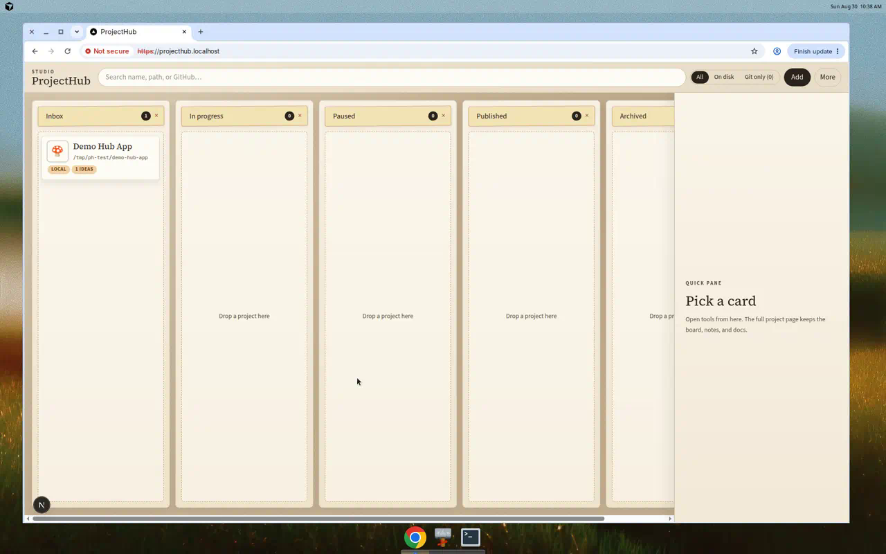
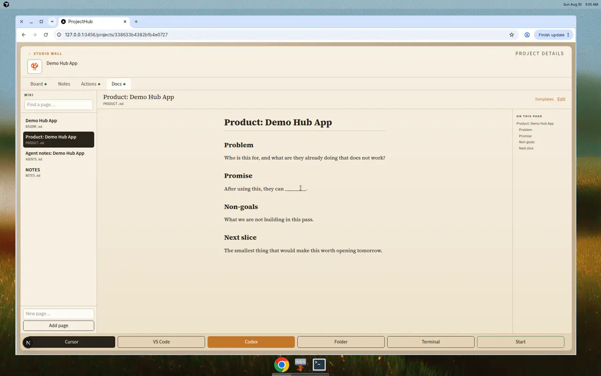

# ProjectHub

A local studio board for people who vibe-code too many projects.

Scan folders, pin GitHub remotes that are not on disk, park ideas on a project page, write the README there, and start the project without hunting for the folder.

ProjectHub is a **personal open-source app**. It is not a hosted SaaS and not Jira. It runs on your machine at `127.0.0.1`. Your board lives in `~/.projecthub`.

[](LICENSE)
[](https://nodejs.org)
[](https://pnpm.io)



## Why it exists

Vibe coding makes it cheap to start a repo and expensive to remember what it was for. ProjectHub is the index-card wall: columns for status, a page per project for notes and docs, and actions to open or start the thing again.

## Features

- Studio kanban with color-coded cards, search, and All / On disk / Git only
- Scan local folders (git repos and common project markers)
- Import GitHub remotes that are not cloned yet (`gh repo clone` when you want a copy)
- Create a project from a markdown template (`README.md`, `PRODUCT.md`, `AGENTS.md`)
- Quick pane on the wall; full project page for board, notes, wiki, icon, and actions
- Per-project board with columns, kinds, points, sprints, and a full-screen view
- Docs as a wiki: sidebar of markdown pages, `[[PRODUCT]]` links, on-this-page outline
- First-run setup: Node, Git, pnpm, and GitHub CLI (`gh`)
- Backend picker: local JSON, SQLite, GitHub, or Supabase (JSON is always written as backup)
- Open Cursor, VS Code, Codex, the folder, or a terminal; start `dev` / `start` or a custom command
- Local trash that moves folders on disk (typed confirmation)



## Requirements

- Node.js 22+
- [pnpm](https://pnpm.io)
- [GitHub CLI](https://cli.github.com/) (`gh auth login`) — required to clone, import, and talk to GitHub
- Optional: [Portless](https://github.com/vercel-labs/portless) for `https://projecthub.localhost`
- Optional: Cursor, VS Code, or Codex if you want those open buttons

## Quick start

```bash
git clone https://github.com/manu-rivas/ProjectHub.git
cd ProjectHub
pnpm install
pnpm dev
```

Open [http://127.0.0.1:3456](http://127.0.0.1:3456).

On first launch, a setup screen checks this machine and lets you pick a backend.

If Portless is installed **and** you turn it on in setup, `pnpm dev` also serves [https://projecthub.localhost](https://projecthub.localhost). If Portless is missing, ProjectHub stays on port 3456. It never requires Portless.

macOS: double-click `Start ProjectHub.command` or `Arrancar ProjectHub.command`. Re-run setup anytime at `/setup`.

```bash
pnpm dev      # 127.0.0.1:3456 (and projecthub.localhost if Portless is on)
pnpm build
pnpm start
pnpm lint
```

## How it works

Click a card on the studio wall for the **quick pane** (open tools, color, clone). **Open project page** goes to `/projects/[id]`.

The **Docs** tab is a wiki of markdown files in the project root. Link pages with `[[PRODUCT]]` or `[text](AGENTS.md)`. Add extra pages such as `NOTES.md`.

Each project also has its own idea board (Backlog / Doing / Done by default). That board is separate from the studio wall. Full screen: `/projects/[id]/board`.

When you create a project, pick a template:

| Template | What you get |
| --- | --- |
| Blank | Empty README / PRODUCT / AGENTS |
| Web app | How to run it, what it promises |
| Library | API-first docs |
| Experiment | Hypothesis and keep/kill |
| Agent / MCP | Tools and hard limits |

Copy or edit templates at `/templates`.

## Data

| Path | Role |
| --- | --- |
| `~/.projecthub/store.json` | Always written. Safe backup and the default backend. |
| `~/.projecthub/catalog.json` | Export of the catalog |
| `~/.projecthub/hub.db` | Optional SQLite copy |
| `~/.projecthub/secrets.json` | Supabase URL and key. Never synced to GitHub. |
| `~/.projecthub/sync/` | Local clone of the optional `projecthub-data` GitHub repo |

Pick one live backend in setup: local JSON, SQLite, GitHub (`gh`), or Supabase. JSON is always written as a backup.

ProjectHub never stores a GitHub token. `gh` is required to clone, import, and optionally sync the board. If you pick the GitHub backend, **Sync** creates or updates a private `projecthub-data` repo and writes `board.json` there.

## Safety

Trash and local-delete are destructive on disk. Trash asks you to type `MOVE TO TRASH`. The older Spanish phrase `MOVER A PAPELERA` is still accepted.

Do not point scan roots at your whole home directory on the first run. Start with the folders where you actually keep repos.

## Contributing

Issues and pull requests are welcome.

- Keep the UI in English.
- This is a local studio index, not a Jira clone. Prefer a small change that helps you resume a project over new workflow ceremony.
- JSON in `~/.projecthub/store.json` must keep working. Optional backends (SQLite, GitHub, Supabase) must not replace that backup.
- Portless stays optional.

```bash
pnpm install
pnpm dev
pnpm lint
```

## License

[MIT](LICENSE) © ProjectHub contributors
